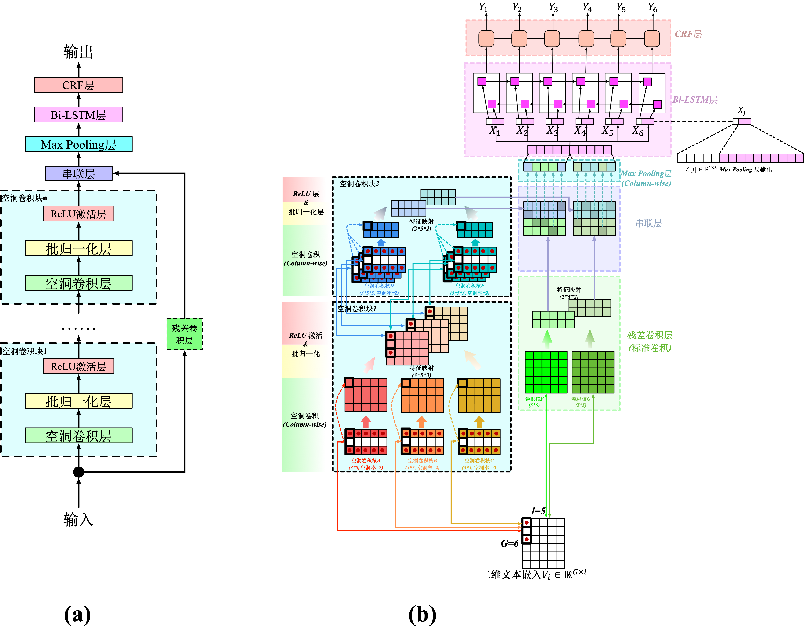
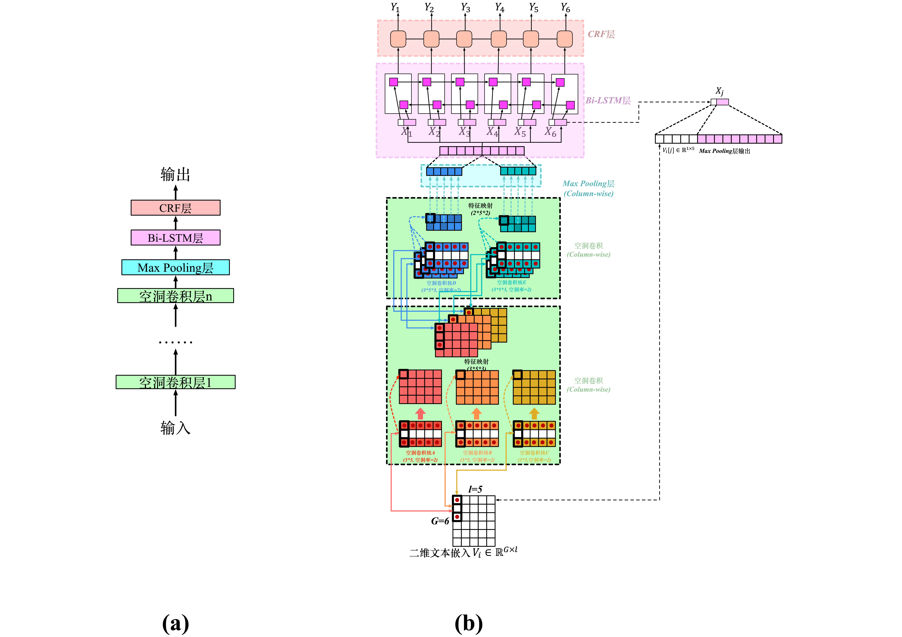

# Dilated-Convolutional-Block-Architecture-Based-Named-Entity-Recognition

This repository includes the code for building __Dilated Convolutional Block Architecture Based Named Entity Recognition Model__ for Chinese News Named Entity Recognition task. Its goal is to recognize three types of Named Entity: PERSON, LOCATION and ORGANIZATION.

This code works on __Python 3.6.5 & TensorFlow 1.8__ and the following repository [https://github.com/Acstream/Dilated-Block-Based-Convolutional-Network,https://github.com/Determined22/zh-NER-TF) gives me much help.

For more details, please view our paper __"Named Entity Recognition Model based on Dilated Convolutional Block Architecture"(CCML 2021)__ By Yue Yuan, Yanli Wang and Kan Liu (URL: https://pan.baidu.com/s/123bgbNT1kBgA8mgwbs_nOw Extraction Code: giqv).

## Model
You can build three kinds of models (including two of our proposed models) in __model.py__ just by annotating some codes in "def build_graph():" function (self.dcba_op() and self.dcl_op()):

For building DCBA+Bi-LSTM+CRF model (our proposed model), you need to annotate "self.dcl_op()" and keep "self.dcba_op()" and other codes in "def build_graph():" remain.

For building DCL+Bi-LSTM+CRF model (our proposed model), you need to annotate "self.dcba_op()" and keep "self.dcl_op()" and other codes in "def build_graph():" remain.

For building Bi-LSTM+CRF model, you need to annotate "self.dcba_op()" together with "self.dcl_op()" and keep other codes in "def build_graph():" remain.

The above models are provided by our paper __"Named Entity Recognition Model based on Dilated Convolutional Block Architecture"(CCML 2021)__. 

The structure of __"Dilated Convolutional Block Architecture Based Named Entity Recognition Model"__(DCBA+Bi-LSTM+CRF) looks like the following illustration:



The structure of __"Dilated Convolutional Layer Based Named Entity Recognition Model"__(DCL+Bi-LSTM+CRF) looks like the following illustration:



For one Chinese sentence, each character in this sentence has / will have a tag which belongs to the set {O, B-PER, I-PER, B-LOC, I-LOC, B-ORG, I-ORG}.

The first layer, __look-up layer__, aims at transforming each character representation from one-hot vector into *character embedding*. In this code I initialize the embedding matrix randomly. We could add some linguistic knowledge later. For example, do tokenization and use pre-trained word-level embedding, then augment character embedding with the corresponding token's word embedding. In addition, we can get the character embedding by combining low-level features (please see paper[2]'s section 4.1 and paper[3]'s section 3.3 for more details).、

The second layer, __DCBA or DCL layer__, can efficiently extract contextual features from input embeddings.

The third layer, __BiLSTM layer__, can efficiently use *both past and future* input information and extract features automatically.

The fourth layer, __CRF layer__,  labels the tag for each character in one sentence. If we use a Softmax layer for labeling, we might get ungrammatic tag sequences beacuse the Softmax layer labels each position independently. We know that 'I-LOC' cannot follow 'B-PER' but Softmax doesn't know. Compared to Softmax, a CRF layer can use *sentence-level tag information* and model the transition behavior of each two different tags.

## Dataset

|    | #sentence | #PER | #LOC | #ORG |
| :----: | :---: | :---: | :---: | :---: |
| train  | 46364 | 17615 | 36517 | 20571 |
| test   | 4365  | 1973  | 2877  | 1331  |

It looks like a portion of [MSRA corpus](http://sighan.cs.uchicago.edu/bakeoff2006/). You can download the dataset from the link in `./data_path/original/link.txt`

### data files

The directory `./Data` contains:

- the preprocessed data files, `train_data` and `test_data` 
- a vocabulary file `word2id.pkl` that maps each character to a unique id  

For generating vocabulary file, please refer to the code in `data.py`. 

### data format

Each data file should be in the following format:

```
中	B-LOC
国	I-LOC
很	O
大	O

句	O
子	O
结	O
束	O
是	O
空	O
行	O

```

If you want to use your own dataset, please: 

- transform your corpus to the above format
- generate a new vocabulary file

## How to Run

### train

`python main.py --mode=train `

### test

`python main.py --mode=test --demo_model=dcba_1`

Please set the parameter `--demo_model` to the model that you want to test. `dcba_1` is the model trained by me. 

An official evaluation tool for computing metrics: [here (click 'Instructions')](http://sighan.cs.uchicago.edu/bakeoff2006/)


